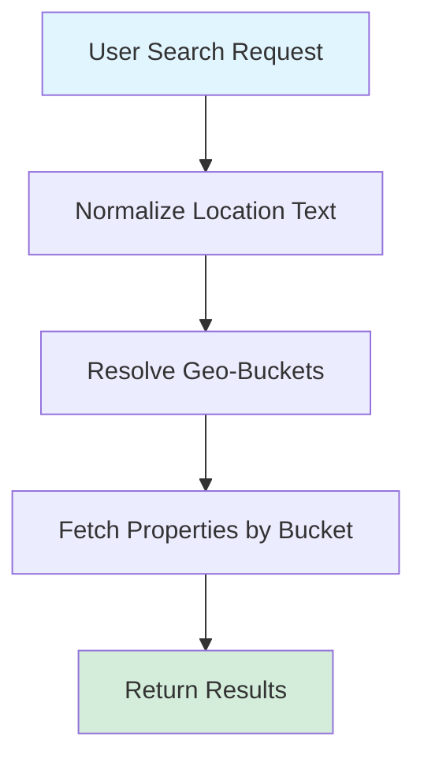

# Expertlisting - Location Search Normalization Using Geobuckets

## Overview

This document outlines the design for normalizing location search queries in the Expertlisting platform using geobuckets. The goal is to improve the accuracy and relevance of search results by standardizing location inputs and leveraging geospatial data.

---

## Architecture Strategy

### Chosen Approach: Hybrid Geo-Bucket System

The chosen strategy combines **GeoHash-based spatial bucketing** as the primary method with a secondary layer that uses **location name normalization**. This hybrid approach ensures both spatial accuracy and user-friendly text-based search capabilities.

---

## Core Components

### 1. Geohash Bucketing

Geohash bucketing provides efficient spatial indexing for property locations.

#### How It Works

- Each property's latitude and longitude are encoded into a geohash string at a fixed precision (e.g., precision 7)
- Properties that share the same geohash prefix belong to the same geo-bucket
- Precision is chosen to approximate a neighborhood-sized area (≈150–300m)

#### Benefits

- **Efficient indexing**: Fast spatial indexing and querying
- **Deterministic assignment**: No insertion-order issues
- **Scalability**: Scales well with large datasets

#### Edge Case Handling

Due to geohashes being rectangular, searches also check adjacent geohashes to avoid edge-case misses where a property lies near a boundary.

---

### 2. Location Name Normalization

Spatial proximity alone is insufficient because users search using free-text location names.

#### Normalization Process

Location names from user queries are normalized using a combination of:

1. **Lowercasing** - Convert all text to lowercase
2. **Removing punctuation and whitespace** - Strip special characters
3. **Standardizing abbreviations** - e.g., "St." → "Street"
4. **Removing stop-words** - e.g., "lagos", "ajah", "state"
5. **Synonym mapping** - e.g., "NYC" → "New York City"
6. **Final normalization** - e.g., "sangotedo, ajah" → "sangotedo"

#### Optional Enhancement

Fuzzy matching techniques (e.g., Levenshtein distance) can be applied to handle typos and variations.

---

## Database Schema

### GeoBucket Table

Stores geohash-based bucket information.

| Field | Type | Constraints | Description |
|-------|------|-------------|-------------|
| `id` | UUID | Primary Key | Unique bucket identifier |
| `geohash_prefix` | String | Indexed | The geohash prefix representing the geo-bucket |
| `created_at` | Timestamp | - | Record creation time |
| `updated_at` | Timestamp | - | Last update time |

**Indexes:**
- Primary index on `geohash_prefix` for fast lookups

---

### Property Table

Stores property information with geospatial data.

| Field | Type | Constraints | Description |
|-------|------|-------------|-------------|
| `id` | UUID | Primary Key | Unique property identifier |
| `title` | String | - | Property title |
| `latitude` | Float | - | Geographic latitude |
| `longitude` | Float | - | Geographic longitude |
| `geohash` | String | Indexed | Derived geohash |
| `normalized_location_name` | String | - | Normalized location name |
| `location_name` | String | - | Original location name |
| `price` | Integer | - | Price in cents |
| `bedrooms` | Integer | - | Number of bedrooms |
| `bathrooms` | Integer | - | Number of bathrooms |
| `bucket_id` | UUID | Foreign Key | Reference to GeoBucket |
| `created_at` | Timestamp | - | Record creation time |
| `updated_at` | Timestamp | - | Last update time |

**Indexes:**
- Composite index on `geohash` for efficient querying
- Index on `bucket_id` for join performance

---

## Search Query Flow

### Step-by-Step Process

1. **User Input**: User submits a search query with a location name
2. **Normalization**: The location name is normalized using the defined normalization process
3. **Resolve Geo-Buckets**: Resolve candidate geo-buckets using:
   - Nearby geohashes (including neighbors)
   - Normalized location name matching to find relevant buckets
4. **Database Query**: Query the Property table for properties that belong to the resolved geo-buckets and match the normalized location name
5. **Return Results**: Return aggregated results

> [!NOTE]
> Searches operate on geo-buckets, not the full properties table, ensuring consistent performance as data grows.

---

## Performance and Scalability

### Caching Strategy

- **Search results**: Cache results per normalized location key
- **Bucket lookups**: Cache geohash → bucket_id mappings
- **Cache invalidation**: Invalidate cache on property creation

### Pagination

- **Cursor-based pagination** for property lists
- Prevents expensive OFFSET queries

### Scaling to 500k+ Properties

- **Read replicas** can be added for search endpoints
- **Deterministic geohash buckets** prevent bucket explosion
- **Horizontal sharding** enabled by geo-buckets (by region)
- **Background jobs** can periodically rebalance or merge sparse buckets

---

## Future Enhancements

- [ ] Integrate third-party geocoding APIs for better location resolution
- [ ] Add monitoring for bucket density anomalies
- [ ] Use H3 hexagonal indexing for higher precision
- [ ] Add admin tooling to merge/split buckets
- [ ] Incorporate popularity-weighted bucket resolution

